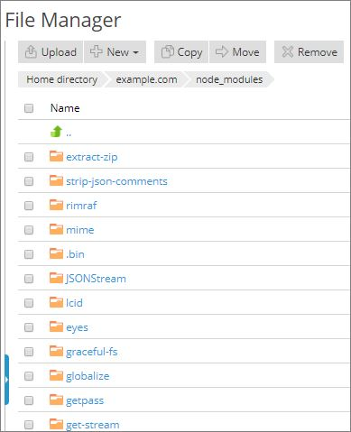

# loopback-example-angular-iisnode

Loopback is a grate library. But if you want to use it inside a Windows host like Azur that have `iisnode` as their `Node.JS` engine, then you will be faced with so many problems. In this code which is a fork from offical [loopback-example-angular](https://github.com/strongloop/loopback-example-angular) I will try to show you how to run this example inside the windows host.
My host controll panel is the `Pleks Onyx`. Also My explanation will be reflected after the offical read me text that explanes how to use this code in your local machin.

# A) How to run offical `loopback-example-angular` in your local machine. 

```
$ git clone https://github.com/strongloop/loopback-example-angular.git
$ cd loopback-example-angular
$ npm install
$ node . # then browse to localhost:3000
```

A simple todo list using AngularJS on the client-side and LoopBack on the
server-side.

## Prerequisites

### Tutorials

- [Getting started with LoopBack](https://github.com/strongloop/loopback-getting-started)
- [Tutorial series, step 1](https://github.com/strongloop/loopback-example#the-basics)

### Knowledge of

- [Angular](https://angularjs.org/)
- [Angular Resource](https://docs.angularjs.org/api/ngResource/service/$resource)
- [AngularUI Router](https://github.com/angular-ui/ui-router)
- [Bootstrap](http://getbootstrap.com/)
- [Bower](http://bower.io/)
- [LoopBack](http://loopback.io/)
- [LoopBack AngularJS SDK](http://loopback.io/doc/en/lb2/AngularJS-JavaScript-SDK.html)
- [LoopBack models](http://loopback.io/doc/en/lb2/Defining-models.html)
- [LoopBack middleware](http://loopback.io/doc/en/lb2/Defining-middleware.html)

## Procedure

### Create the application

#### Application information

- Name: `loopback-example-angular`
- Directory to contain the project: `loopback-example-angular`

```
$ slc loopback loopback-example-angular
... # follow the prompts
$ cd loopback-example-angular
```

### Create the `Todo` model

#### Model information

- Name: `Todo`
  - Data source: `db (memory)`
  - Base class: `PersistedModel`
  - Expose over REST: `Yes`
  - Custom plural form: *Leave blank*
  - Properties:
    - `content`
      - String
      - Required

```
$ slc loopback:model Todo
... # follow the prompts
```

### Configure the vendor directory

In the project root, create [`.bowerrc`](https://github.com/strongloop/loopback-example-angular/blob/master/.bowerrc).

>Bower installs packages in `bower_components` by default, but we reconfigure
this to `client/vendor` to make [importing files into `index.html`](https://github.com/strongloop/loopback-example-angular/blob/master/client/index.html#L33-L37)
more convenient.

### Install client-side dependencies

From the project root, run:

```
$ bower install angular angular-resource angular-ui-router bootstrap
```

### Create the home page

Create [`index.html`](https://github.com/strongloop/loopback-example-angular/blob/master/client/index.html) in the [`client`](https://github.com/strongloop/loopback-example-angular/blob/master/client) directory.

### Create the main stylesheet

Create a [`css` directory](https://github.com/strongloop/loopback-example-angular/blob/master/client/css) to store stylesheets.

```
$ mkdir client/css
```

In this directory, create [`styles.css`](https://github.com/strongloop/loopback-example-angular/blob/master/client/css/styles.css).

### Serve static assets from the `client` directory

Delete `/server/boot/root.js`.

Add static middleware to the [`files` section in `middleware.json`](https://github.com/strongloop/loopback-example-angular/blob/master/server/middleware.json#L23-L27)
.

### Create `app.js`

Create a [`js` directory](https://github.com/strongloop/loopback-example-angular/blob/master/client/js) to hold scripts files.

```
$ mkdir client/js
```

In this directory, create [`app.js`](https://github.com/strongloop/loopback-example-angular/blob/master/client/js/app.js).

>Notice we declare [`lbServices`](https://github.com/strongloop/loopback-example-angular/blob/master/client/js/app.js#L3) as a dependency. We
will generate this file using the `lb-ng` command in a later step.

### Create `todo.html`

Create a [`views`](https://github.com/strongloop/loopback-example-angular/blob/master/client/views) to store view templates.

```
$ mkdir client/views
```

In this directory, create [`todo.html`](https://github.com/strongloop/loopback-example-angular/blob/master/client/views/todo.html).

### Create `controllers.js`

Create a [`controllers`](https://github.com/strongloop/loopback-example-angular/blob/master/client/js/controllers) directory to store controller
files.

```
$ mkdir client/js/controllers
```

In this directory, create [`todo.js`](https://github.com/strongloop/loopback-example-angular/blob/master/client/js/controllers/todo.js).

### Generate `lb-services.js`

Create a [`services` directory](https://github.com/strongloop/loopback-example-angular/blob/master/client/js/services) to store service files.

```
$ mkdir client/js/services
```

`lb-ng` is automatically installed along with the `slc` command-line tool (ie.
when you ran `npm install -g strongloop`). `lb-ng` takes two arguments: the
path to [`server.js`](https://github.com/strongloop/loopback-example-angular/blob/master/server/server.js) and the path
to the [generated services file](https://github.com/strongloop/loopback-example-angular/blob/master/client/js/services/lb-services.js).
[`lb-services.js`](https://github.com/strongloop/loopback-example-angular/blob/master/client/js/services/lb-services.js) is an Angular service
used to interact with LoopBack models.

Create [`lb-services.js`](https://github.com/strongloop/loopback-example-angular/blob/master/client/js/services/lb-services.js) using the `lb-ng`
command.

```
$ lb-ng server/server.js client/js/services/lb-services.js
```

### Run the application

From the project root, enter `node .` and browse to [`localhost:3000`](http://localhost:3000)
to view the application.

---

[More LoopBack examples](https://loopback.io/doc/en/lb3/Tutorials-and-examples.html)

---

# B) How to deploy `loopback-example-angular` to our remote production host which has `iisnode`???

Uptil now what ever you red was original text from the official `loopback-example-angular` example code. From now I will try to explain how to deploy this code to a remote host for your end users.

You don't need to fork or clone my code. Just keep it beside of your code for comparision. 

I will illustrate from very bigining, this toturial is based on `Pleks Onyx` control panel, but the configuration can be used for any other iisnode like Microsoft Azur as well.


      





```javascript
//start.js
var server = require('./server/server.js');
server.start();
```


```xml
//Old (Original) web.config
<?xml version="1.0" encoding="UTF-8"?>
<configuration>
    <system.webServer>
        <httpErrors>
            <remove statusCode="502" subStatusCode="-1" />
            <remove statusCode="501" subStatusCode="-1" />
            <remove statusCode="500" subStatusCode="-1" />
            <remove statusCode="412" subStatusCode="-1" />
            <remove statusCode="406" subStatusCode="-1" />
            <remove statusCode="405" subStatusCode="-1" />
            <remove statusCode="404" subStatusCode="-1" />
            <remove statusCode="403" subStatusCode="-1" />
            <remove statusCode="401" subStatusCode="-1" />
            <remove statusCode="400" />
            <error statusCode="400" path="C:\Inetpub\vhosts\YOUR_USER_SAPCE\error_docs\bad_request.html" />
            <remove statusCode="407" />
            <error statusCode="407" path="C:\Inetpub\vhosts\YOUR_USER_SAPCE\error_docs\proxy_authentication_required.html" />
            <remove statusCode="414" />
            <error statusCode="414" path="C:\Inetpub\vhosts\YOUR_USER_SAPCE\error_docs\request-uri_too_long.html" />
            <remove statusCode="415" />
            <error statusCode="415" path="C:\Inetpub\vhosts\YOUR_USER_SAPCE\error_docs\unsupported_media_type.html" />
            <remove statusCode="503" />
            <error statusCode="503" path="C:\Inetpub\vhosts\YOUR_USER_SAPCE\error_docs\maintenance.html" />
            <error statusCode="401" prefixLanguageFilePath="" path="C:\Inetpub\vhosts\YOUR_USER_SAPCE\error_docs\unauthorized.html" />
            <error statusCode="403" prefixLanguageFilePath="" path="C:\Inetpub\vhosts\YOUR_USER_SAPCE\error_docs\forbidden.html" />
            <error statusCode="404" prefixLanguageFilePath="" path="C:\Inetpub\vhosts\YOUR_USER_SAPCE\error_docs\not_found.html" />
            <error statusCode="405" prefixLanguageFilePath="" path="C:\Inetpub\vhosts\YOUR_USER_SAPCE\error_docs\method_not_allowed.html" />
            <error statusCode="406" prefixLanguageFilePath="" path="C:\Inetpub\vhosts\YOUR_USER_SAPCE\error_docs\not_acceptable.html" />
            <error statusCode="412" prefixLanguageFilePath="" path="C:\Inetpub\vhosts\YOUR_USER_SAPCE\error_docs\precondition_failed.html" />
            <error statusCode="500" prefixLanguageFilePath="" path="C:\Inetpub\vhosts\YOUR_USER_SAPCE\error_docs\internal_server_error.html" />
            <error statusCode="501" prefixLanguageFilePath="" path="C:\Inetpub\vhosts\YOUR_USER_SAPCE\error_docs\not_implemented.html" />
            <error statusCode="502" prefixLanguageFilePath="" path="C:\Inetpub\vhosts\YOUR_USER_SAPCE\error_docs\bad_gateway.html" />
        </httpErrors>
    </system.webServer>
</configuration>

```


```xml
//Modified web.config
<?xml version="1.0" encoding="UTF-8"?>
<configuration>
   <system.webServer>
      <!-- indicates that the hello.js file is a node.js application 
    to be handled by the iisnode module -->
      <handlers>
         <add name="iisnode" path="start.js" verb="*" modules="iisnode" />
         <!-- Uncomment below handler if using Socket.io -->
         <add name="iisnode-socketio" path="start.js" verb="*" modules="iisnode" />
      </handlers>
      <!-- 
      the iisnode section configures the behavior of the node.js IIS module 
      setting values below are defaults

    * node_env - determines the environment (production, development, staging, ...) in which 
      child node processes run; if nonempty, is propagated to the child node processes as their NODE_ENV
      environment variable; the default is the value of the IIS worker process'es NODE_ENV
      environment variable

    * nodeProcessCommandLine - command line starting the node executable; in shared
      hosting environments this setting would typically be locked at the machine scope.
      
    * interceptor - fully qualified file name of a node.js application that will run instead of an actual application
      the request targets; the fully qualified file name of the actual application file is provided as the first parameter
      to the interceptor application; default interceptor supports iisnode logging
      
    * nodeProcessCountPerApplication - number of node.exe processes that IIS will start per application;
      setting this value to 0 results in creating one node.exe process per each processor on the machine
      
    * maxConcurrentRequestsPerProcess - maximum number of reqeusts one node process can 
      handle at a time
      
    * maxNamedPipeConnectionRetry - number of times IIS will retry to establish a named pipe connection with a
      node process in order to send a new HTTP request
      
    * namedPipeConnectionRetryDelay - delay in milliseconds between connection retries
    
    * maxNamedPipeConnectionPoolSize - maximum number of named pipe connections that will be kept in a connection pool; 
      connection pooling helps improve the performance of applications that process a large number of short lived HTTP requests
      
    * maxNamedPipePooledConnectionAge - age of a pooled connection in milliseconds after which the connection is not reused for
      subsequent requests
    
    * asyncCompletionThreadCount - size of the IO thread pool maintained by the IIS module to process asynchronous IO; setting it
      to 0 (default) results in creating one thread per each processor on the machine
    
    * initialRequestBufferSize - initial size in bytes of a memory buffer allocated for a new HTTP request
    
    * maxRequestBufferSize - maximum size in bytes of a memory buffer allocated per request; this is a hard limit of 
      the serialized form of HTTP request or response headers block
      
    * watchedFiles - semi-colon separated list of files that will be watched for changes; a change to a file causes the application to recycle;
      each entry consists of an optional directory name plus required file name which are relative to the directory where the main application entry point 
      is located; wild cards are allowed in the file name portion only; for example: "*.js;node_modules\foo\lib\options.json;app_data\*.config.json"
      
    * uncFileChangesPollingInterval - applications are recycled when the underlying *.js file is modified; if the file resides
      on a UNC share, the only reliable way to detect such modifications is to periodically poll for them; this setting 
      controls the polling interval
      
    * gracefulShutdownTimeout - when a node.js file is modified, all node processes handling running this application are recycled;
      this setting controls the time (in milliseconds) given for currently active requests to gracefully finish before the 
      process is terminated; during this time, all new requests are already dispatched to a new node process based on the fresh version 
      of the application
    
    * loggingEnabled - controls whether stdout and stderr streams from node processes are captured and made available over HTTP
    
    * logDirectory - directory name relative to the main application file that will store files with stdout and stderr captures; 
      individual log file names have unique file names; log files are created lazily (i.e. when the process actually writes something
      to stdout or stderr); an HTML index of all log files is also maintained as index.html in that directory;
      by default, if your application is at http://foo.com/bar.js, logs will be accessible at http://foo.com/iisnode;
      SECURITY NOTE: if log files contain sensitive information, this setting should be modified to contain enough entropy to be considered
      cryptographically secure; in most situations, a GUID is sufficient
      
    * debuggingEnabled - controls whether the built-in debugger is available
      
    * debuggerPortRange - range of TCP ports that can be used for communication between the node-inspector debugger and the debugee; iisnode
      will round robin through this port range for subsequent debugging sessions and pick the next available (free) port to use from the range
      
    * debuggerPathSegment - URL path segment used to access the built-in node-inspector debugger; given a node.js application at 
      http://foo.com/bar/baz.js, the debugger can be accessed at http://foo.com/bar/baz.js/{debuggerPathSegment}, by default
      http://foo.com/bar/baz.js/debug
    
    * debugHeaderEnabled - boolean indicating whether iisnode should attach the iisnode-debug HTTP response header with 
      diagnostics information to all responses
    
    * maxLogFileSizeInKB - maximum size of a single log file in KB; once a log file exceeds this limit a new log file is created

    * maxTotalLogFileSizeInKB - maximum total size of all log files in the logDirectory; once exceeded, old log files are removed
    
    * maxLogFiles - maximum number of log files in the logDirectory; once exceeded, old log files are removed
    
    * devErrorsEnabled - controls how much information is sent back in the HTTP response to the browser when an error occurrs in iisnode; 
      when true, error conditions in iisnode result in HTTP 200 response with the body containing error details; when false,
      iisnode will return generic HTTP 5xx responses
      
    * flushResponse - controls whether each HTTP response body chunk is immediately flushed by iisnode; flushing each body chunk incurs 
      CPU cost but may improve latency in streaming scenarios
      
    * enableXFF - controls whether iisnode adds or modifies the X-Forwarded-For request HTTP header with the IP address of the remote host
    
    * promoteServerVars - comma delimited list of IIS server variables that will be propagated to the node.exe process in the form of 
      x-iisnode-<server_variable_name> HTTP request headers; for a list of IIS server variables available see 
      http://msdn.microsoft.com/en-us/library/ms524602(v=vs.90).aspx; for example "AUTH_USER,AUTH_TYPE"
      
    * configOverrides - optional file name containing overrides of configuration settings of the iisnode section of web.config; 
      the format of the file is a small subset of YAML: each setting is represented as a <key>: <value> on a separate line 
      and comments start with # until the end of the line, e.g. 
            # This is a sample iisnode.yml file
            nodeProcessCountPerApplication: 2
            maxRequestBufferSize: 8192 # increasing from the default
            # maxConcurrentRequestsPerProcess: 512 - commented out setting
      
    -->
      <iisnode node_env="%node_env%" nodeProcessCountPerApplication="1" maxConcurrentRequestsPerProcess="1024" maxNamedPipeConnectionRetry="100" namedPipeConnectionRetryDelay="250" maxNamedPipeConnectionPoolSize="512" maxNamedPipePooledConnectionAge="30000" asyncCompletionThreadCount="0" initialRequestBufferSize="4096" maxRequestBufferSize="65536" watchedFiles="*.js;iisnode.yml" uncFileChangesPollingInterval="5000" gracefulShutdownTimeout="60000" loggingEnabled="true" logDirectory="iisnode" debuggingEnabled="true" debugHeaderEnabled="false" debuggerPortRange="5058-6058" debuggerPathSegment="debug" maxLogFileSizeInKB="128" maxTotalLogFileSizeInKB="1024" maxLogFiles="20" devErrorsEnabled="true" flushResponse="false" enableXFF="false" promoteServerVars="" configOverrides="iisnode.yml" />
      <!-- Original part -->
      <httpErrors>
         <remove statusCode="502" subStatusCode="-1" />
         <remove statusCode="501" subStatusCode="-1" />
         <remove statusCode="500" subStatusCode="-1" />
         <remove statusCode="412" subStatusCode="-1" />
         <remove statusCode="406" subStatusCode="-1" />
         <remove statusCode="405" subStatusCode="-1" />
         <remove statusCode="404" subStatusCode="-1" />
         <remove statusCode="403" subStatusCode="-1" />
         <remove statusCode="401" subStatusCode="-1" />
         <remove statusCode="400" />
         <error statusCode="400" path="C:\Inetpub\vhosts\mjzsoft.com\error_docs\bad_request.html" />
         <remove statusCode="407" />
         <error statusCode="407" path="C:\Inetpub\vhosts\mjzsoft.com\error_docs\proxy_authentication_required.html" />
         <remove statusCode="414" />
         <error statusCode="414" path="C:\Inetpub\vhosts\mjzsoft.com\error_docs\request-uri_too_long.html" />
         <remove statusCode="415" />
         <error statusCode="415" path="C:\Inetpub\vhosts\mjzsoft.com\error_docs\unsupported_media_type.html" />
         <remove statusCode="503" />
         <error statusCode="503" path="C:\Inetpub\vhosts\mjzsoft.com\error_docs\maintenance.html" />
         <error statusCode="401" prefixLanguageFilePath="" path="C:\Inetpub\vhosts\mjzsoft.com\error_docs\unauthorized.html" />
         <error statusCode="403" prefixLanguageFilePath="" path="C:\Inetpub\vhosts\mjzsoft.com\error_docs\forbidden.html" />
         <error statusCode="404" prefixLanguageFilePath="" path="C:\Inetpub\vhosts\mjzsoft.com\error_docs\not_found.html" />
         <error statusCode="405" prefixLanguageFilePath="" path="C:\Inetpub\vhosts\mjzsoft.com\error_docs\method_not_allowed.html" />
         <error statusCode="406" prefixLanguageFilePath="" path="C:\Inetpub\vhosts\mjzsoft.com\error_docs\not_acceptable.html" />
         <error statusCode="412" prefixLanguageFilePath="" path="C:\Inetpub\vhosts\mjzsoft.com\error_docs\precondition_failed.html" />
         <error statusCode="500" prefixLanguageFilePath="" path="C:\Inetpub\vhosts\mjzsoft.com\error_docs\internal_server_error.html" />
         <error statusCode="501" prefixLanguageFilePath="" path="C:\Inetpub\vhosts\mjzsoft.com\error_docs\not_implemented.html" />
         <error statusCode="502" prefixLanguageFilePath="" path="C:\Inetpub\vhosts\mjzsoft.com\error_docs\bad_gateway.html" />
      </httpErrors>
      <!--End of Original part -->
      <!-- One more setting that can be modified is the path to the node.exe executable and the interceptor:-->
      <!--
    <iisnode
      nodeProcessCommandLine="&quot;%programfiles%\nodejs\node.exe&quot;" 
      interceptor="&quot;%programfiles%\iisnode\interceptor.js&quot;" />    
    -->
      <rewrite>
         <rules>
            <!-- Don't interfere with requests for node-inspector debugging -->
            <rule name="NodeInspector" patternSyntax="ECMAScript" stopProcessing="true">
               <match url="^start.js\/debug[\/]?" />
            </rule>
            <!-- First we consider whether the incoming URL matches a physical file in the /public folder -->
            <rule name="StaticContent" patternSyntax="Wildcard">
               <action type="Rewrite" url="client/{R:0}" logRewrittenUrl="true" />
               <conditions>
                  <add input="{REQUEST_FILENAME}" matchType="IsFile" negate="true" />
               </conditions>
               <match url="*.*" />
            </rule>
            <!-- All other URLs are mapped to the Node.js application entry point -->
            <rule name="DynamicContent">
               <conditions>
                  <add input="{REQUEST_FILENAME}" matchType="IsFile" negate="True" />
               </conditions>
               <action type="Rewrite" url="start.js" />
            </rule>
            <rule name="SocketIO" patternSyntax="ECMAScript">
               <match url="socket.io.+" />
               <action type="Rewrite" url="start.js" />
            </rule>
         </rules>
      </rewrite>
      <modules>
         <remove name="WebDAVModule" />
      </modules>
      <directoryBrowse enabled="false" />
   </system.webServer>
</configuration>
```


